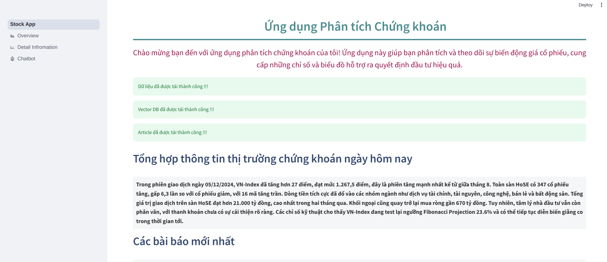
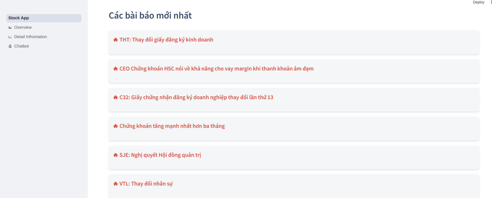
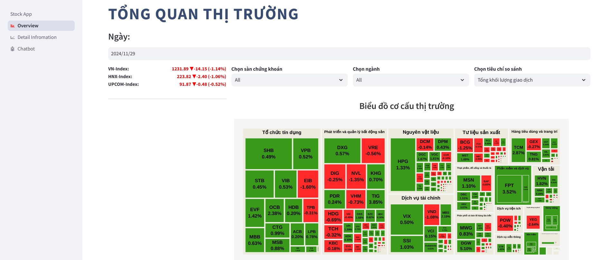
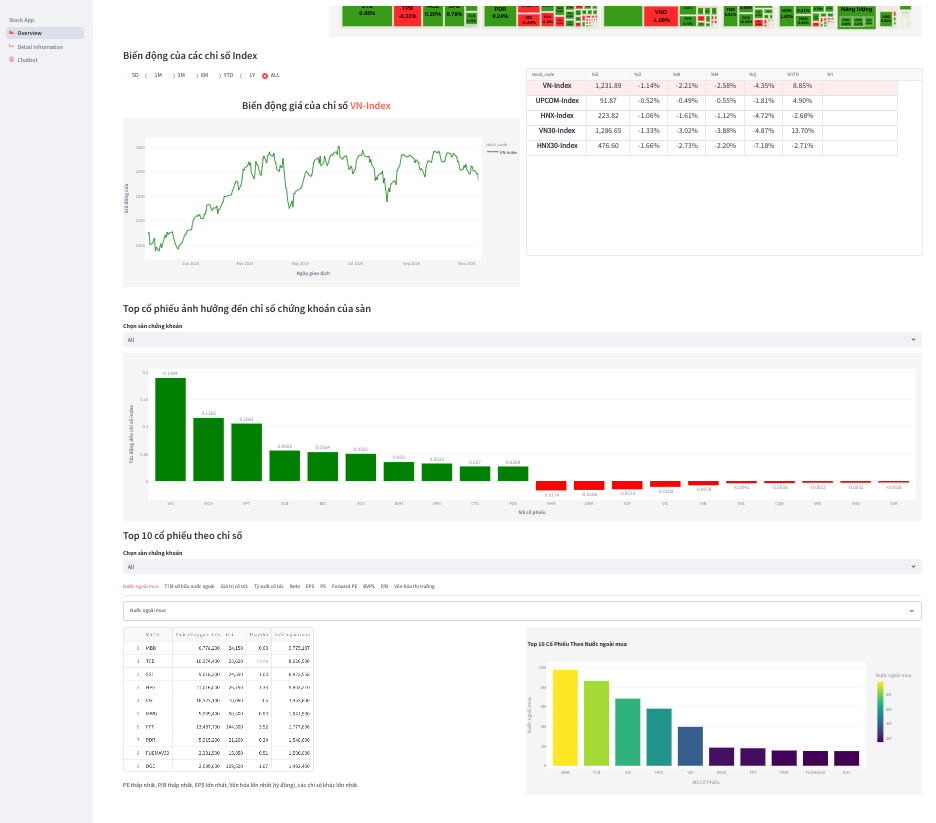
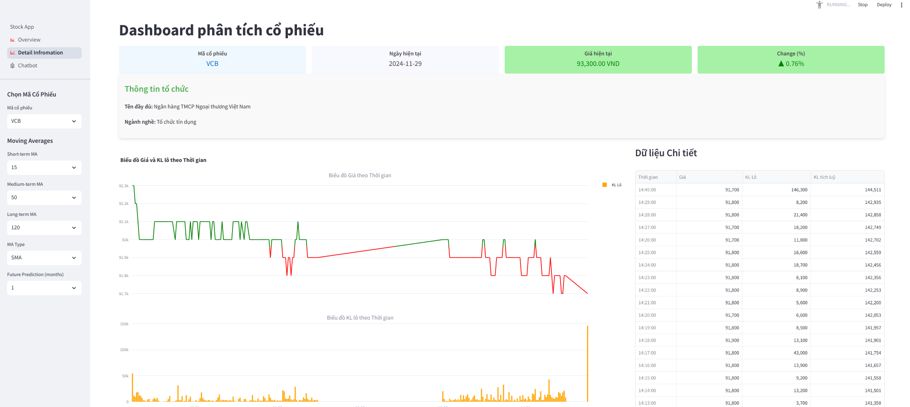
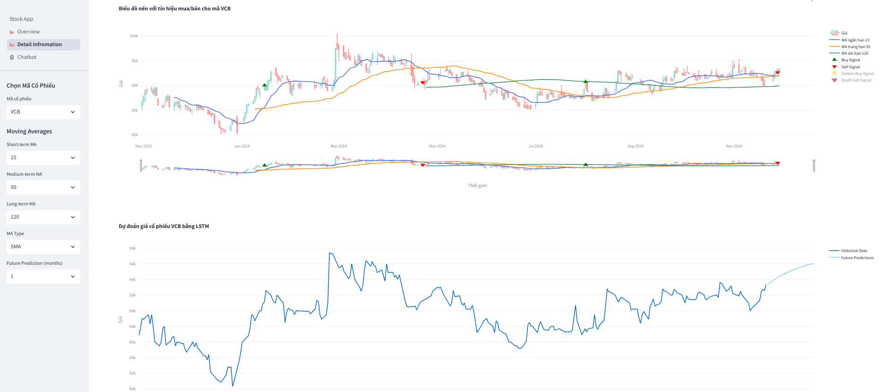
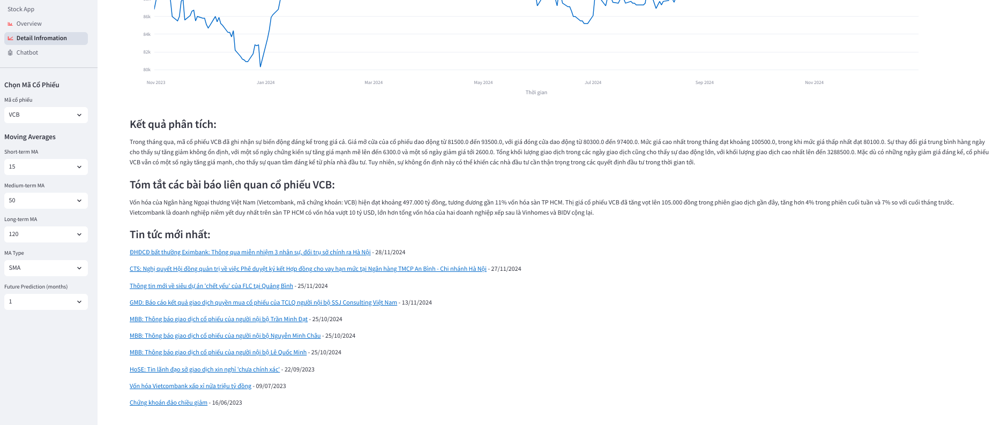
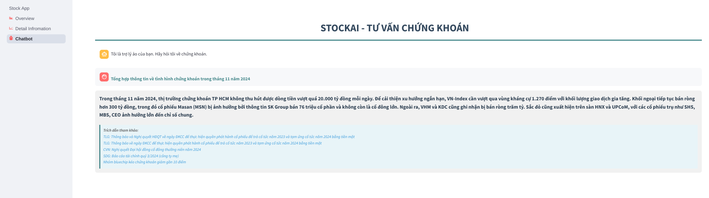

# Ứng dụng phân tích chỉ số chứng Khoán Vietstock
Ứng dụng phân tích dữ liệu thông minh

| Họ và tên                    | MSSV     | Github            |
| ---------------------------- | -------- | ----------------- |
| Nguyễn Văn Quang Hưng        | 21120247 | @HungLVT          |
| Huỳnh Cao Khôi               | 21120275 | @bonkh            |
| Hoàng Trung Nam              | 21120290 | @HTNam1710        |
| Chiêm Bỉnh Nguyên            | 21120294 | @DSGrid23         |
| Huỳnh Trí Nhân               | 21120302 | @HuynhTriNhan     |
| Nguyễn Đức Mạnh              | 20120019 | @manhhk15         |

## 1. Giới thiệu 
- Ứng dụng phân tích chỉ số chứng khoán Vietstock là ứng dụng giúp người dùng có thể phân tích dữ liệu chứng khoán một cách nhanh chóng và hiệu quả. Ứng dụng sử dụng dữ liệu từ trang web [Vietstock](https://finance.vietstock.vn/ket-qua-giao-dich?tab=thong-ke-gia).

### 1.1 Công nghệ sử dụng
- Airflow: Lập lịch thu thập các chỉ số chứng khoáng hằng ngày
- Streamlit: Hiển thị dữ liệu chứng khoán và phân tích dữ liệu
- Docker: Containerize ứng dụng
- RAG (Retrieval-Augmented Generation): Mô hình chatbot trả lời câu hỏi về dữ liệu chứng khoán

## 2. Cài đặt
### 2.1. Cài đặt môi trường Airflow 
- Đọc file hướng dẫn trong `dags/README.md`

### 2.2. Cài đặt môi trường Streamlit
- Đọc file hướng dẫn trong `Dashboard/README.md`

## 3. Demo

Dưới đây là một số hình ảnh demo cho Dashboard hoàn thiện của nhóm

#### 3.1 Trang chính
Đây là trang chủ của Dashboard, bao gồm các thông tin cơ bản, cũng như là một bản mô tả tóm tắt tình hình cổ phiếu trong phiên giao dịch hiện tại, dựa trên thông tin bài báo tài chính kết hợp phân tích từ mô hình GPT-4o-mini.

Bên cạnh đó còn là các thông tin về tin tức nóng hổi được thu thập từ các nguồn VietStock và VNExpress.

#### 3.2 Tổng quan thị trường

Đây là trang cung cấp thông tin tổng quan của thị trường, được thể hiện qua các biểu đồ thể hiện cơ cấu, biến động thị trường, một số chỉ số tài chính quan trọng.

#### 3.3 Biến động chi tiết

Trang này cung cấp thông tin về các biến động chi tiết của một mã cổ phiếu được chọn, như biến động theo khung giờ, biểu đồ nến thể hiện các tín hiệu mua bán,..

Và các phân tích về tình hình cụ thể của mã cổ phiếu và các bài báo liên quan.

#### 3.4 Chatbot
Trang cuối cùng là 1 chat bot hỏi đáp hỗ trợ người dùng một số thông tin về tình hình thị trường, dựa trên kết quả truy vấn từ dữ liệu bài báo thu thập được.

